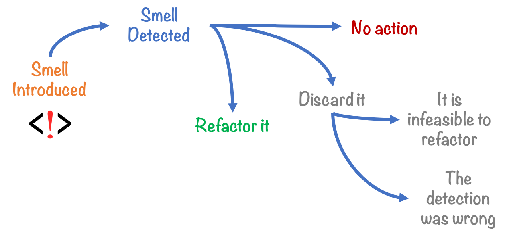

# STA 523 :: Homework 2

## Introduction

Writing clean and elegant code is more that just following a specific style. It 
involves a continuous work flow of rewriting, restructuring, and rethinking how 
your code functions. Homework 2 will get you started in the journey of 
developing code that smells good.

## Tasks

#### Task 1

- Read sections [13.1 - 13.4](https://adv-r.hadley.nz/s3.html) in Advanced R by
  Hadley Wickham.

- Watch [Code Smells and Feels](https://www.youtube.com/watch?v=7oyiPBjLAWY) by
  Jenny Bryan. Her slides and related materials are available on GitHub 
  [here](https://github.com/jennybc/code-smells-and-feels)

#### Task 2

Create a new class for the S3 OO system along with two methods. Include 
constructor, validator, and helper functions. Demonstrate your class and methods
with some examples. One example of inspiration for an S3 class is given by the
"Roman" class. See  `?utils::as.roman()`. Be sure to describe your class and its
functionality.

#### Task 3

Re-implement function `is.armstrong()` from Homework 1 by pooling your 
solutions, using the new topics we have covered, and using topics from
Jenny Bryan's talk. Make it as clean and elegant as possible. Include test 
cases of expected and unexpected inputs.

## Essential details

#### Deadline and submission

**The deadline to submit Homework 2 is 11:59pm on Tuesday, September 17.** Only
your final commit will be graded. Do not forget to push your work to your
assigned group's master repository on GitHub.

#### git / GitHub

Each group will have five branches: master and four others with your GitHub name
as a prefix. 
You will only be able to push to your branch as the master branch is protected. 
To get your work into branch master (the only branch that will be
graded), initiate a pull request on GitHub. This will then merge your work 
into the master branch.

#### Help

- Post your questions in the #hw2 channel on Slack. Explain your error / problem
  in as much detail as possible or give a reproducible example that generates 
  the same error. Make use of the code snippet option available in Slack.

- Visit the instructor or TAs in office hours.

- The instructor and TAs will not answer any questions within the first 24
  hours of this homework being assigned, and they will not answer questions
  within 6 hours of the deadline.

#### Academic integrity

This is a group assignment. You should not communicate specifics about this
assignment with other groups. As a reminder, any code you use or find as 
inspiration must be cited.

>Duke University is a community dedicated to scholarship, leadership, and 
service and to the principles of honesty, fairness, respect, and accountability.
Citizens of this community commit to reflect upon and uphold these principles 
in all academic and non-academic endeavors, and to protect and promote a culture
of integrity. Cheating on exams and quizzes, plagiarism on homework assignments 
and projects, lying about an illness or absence and other forms of academic 
dishonesty are a breach of trust with classmates and faculty, violate the [Duke 
Community Standard](https://gradschool.duke.edu/academics/academic-policies-and-forms/standards-conduct/duke-community-standard),
and will not be tolerated. Such incidences will result in a 
0 grade for all parties involved as well as being reported to the [University 
Judicial Board](https://gradschool.duke.edu/academics/academic-policies-and-forms/standards-conduct/judicial-code-and-procedures). 
Additionally, there may be penalties to your final class grade. 
Please review [Duke's Standards of Conduct](https://gradschool.duke.edu/academics/academic-policies-and-forms/standards-conduct).

#### Grading

**Topic**|**Points**
---------|----------:|
Task 2 |  12
Task 3 |  12
Code style and format | 3
2 commits minimum / member | 2
Named code chunks | 1
**Total**|**30**

- *Documents that fail to knit will receive a 0*.